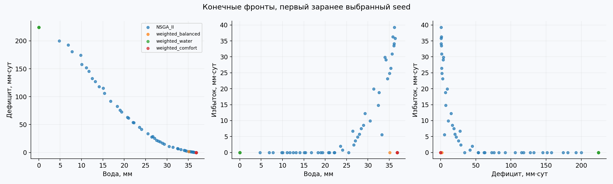
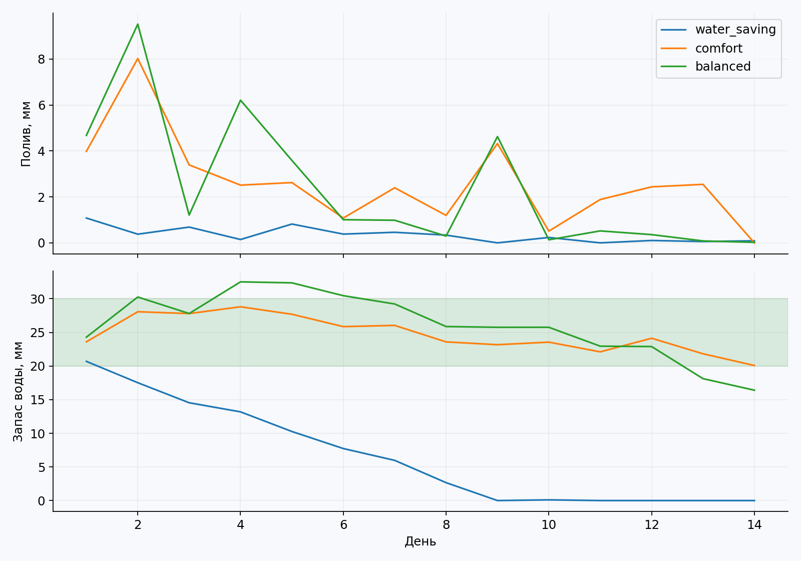
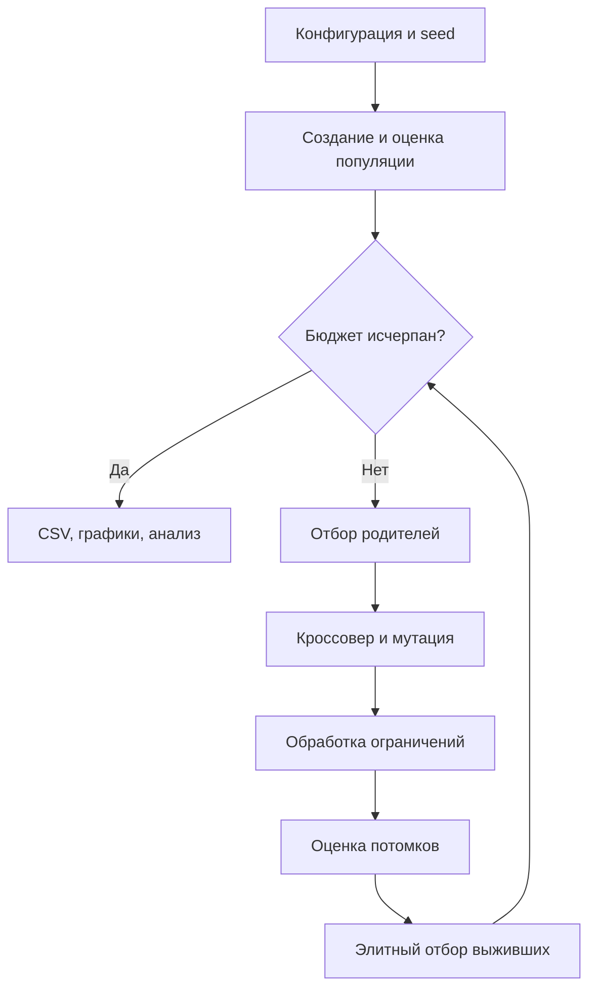

# Лабораторная работа 

Эволюционное программирование и генетические алгоритмы  
Группа **507**, порядковый номер **14**, год **2026**.

Индивидуализация: Q=0, Y=26; V=1+((17·14+7·0+26) mod 20)=**5**.

## Модель и критерии

Решение u — вещественный вектор полива на 14 суток, 0≤uₜ≤12 мм/сут. Генотип непосредственно декодируется в календарный план. Начальный запас влаги S₀=22 мм, ёмкость почвы 45 мм, комфортный диапазон [20,30] мм. Фиксированные осадки и испарение с seed=5071426 сохранены в `data/weather.json`: независимые равномерные значения [0,4] и [3,7] мм/сут, округлённые до 0.001.

На каждом шаге:

$$R_t=S_{t-1}+u_t+r_t-e_t,\quad S_t=\operatorname{clip}(R_t,0,45).$$

Минимизируются одновременно:

$$f_1=\sum_t u_t,\qquad f_2=\sum_t\max(20-R_t,0),\qquad f_3=\sum_t\max(R_t-30,0).$$

Дефицит и избыток считаются по **R до отсечения**: даже при полном высыхании невосполненная потребность сохраняет штраф, а сток не прячет переувлажнение. Это условные интегральные показатели мм·сут. Модель не описывает рост растения и не является агрономическим прогнозом. Основной конфликт — экономия воды против дефицита; избыток добавляет третий критерий, но на хороших режимах может быть нулевым. Все три цели не обязаны попарно конфликтовать.

## NSGA-II и сравнение

Самостоятельно реализованы попарное доминирование, недоминируемая сортировка O(n²m), расстояние скученности и элитное заполнение следующей популяции по фронтам. Для равного ранга турнир из двух особей предпочитает большую скученностную дистанцию; крайние точки по каждому непостоянному критерию получают бесконечную дистанцию. Константный критерий не даёт вклад в расстояние.

48 особей, 63 поколения, **3072 симуляции** на метод и seed. Координатное BLX-смешивание с α=0.2 и вероятностью 0.9; гауссовская мутация σ=1.8 мм с вероятностью 1/14 на координату. Границы обеспечиваются отсечением. Объединённая популяция 96 сокращается до 48 по рангу и дистанции.

Три отдельные базовые конфигурации минимизируют взвешенную сумму f/s, где постоянные масштабы s=(14·12,14·20,14·45)=(168,280,630). Это масштабы нормировки, не доказанные максимумы штрафов. Веса: (1/3,1/3,1/3), (0.8,0.1,0.1), (0.1,0.8,0.1). Для них используется турнир размера 3 и скалярный элитный отбор; вариация и бюджет те же. Каждая свёртка сравнивается с NSGA-II отдельно; объединение трёх свёрток потребовало бы тройной бюджет и здесь не выдаётся за равнобюджетный метод.

## Компромиссы и результаты

Все фронты всех seed сохранены в `fronts.csv`. На рисунке показан первый заранее зафиксированный seed=261400, а не выбранный постфактум самый удачный. Точки недоминируемы внутри своей финальной популяции: глобальная Парето-оптимальность не гарантируется.

Три **различных** представителя NSGA-II:

| Представитель | Вода | Дефицит | Избыток | Смысл |
|---|---:|---:|---:|---|
| Экономия воды | 4.7705 | 200.0861 | 0 | Почти нет полива, сильное высыхание; демонстрирует крайность, не рекомендация |
| Комфорт | 36.9071 | 0 | 0 | Весь горизонт без штрафа за дефицит и избыток |
| Компромисс | 33.2345 | 5.4742 | 5.5783 | Меньший полив ценой отклонений; лучший по диагностической сумме среди оставшихся после первых двух |

Подробные планы и траектории влаги — `representatives.json` и `schedules.png`.

Средний размер фронта NSGA-II — **46.7**, но размер сам по себе не доказывает качество: близкие точки и разные генотипы могут иметь сходные критерии. Средняя лучшая диагностическая сумма нормированных целей — **0.219317** против **0.215087** у равновесной свёртки. NSGA-II не победил специализированную свёртку по её же скалярному критерию; его преимущество здесь — разнообразие доступных компромиссов. Водосберегающие веса приводят почти к нулевому поливу и большому дефициту, поэтому выбор весов имеет предметные последствия.

`coverage.csv` содержит попарное C(A,B): долю решений B, слабо доминируемых хотя бы одним решением A, для одинаковых seed. Равенство засчитывается; метрика несимметрична. Это дополнительное сравнение качества фронтов, без объявления истинного фронта известным. Диагностическая сумма на графике NSGA-II может немонотонно изменяться: алгоритм оптимизирует множество, а не сохраняет минимум этой суммы.





Ограничения: один погодный сценарий, детерминированная модель, нет устойчивости к ошибке прогноза. Следующий шаг — серия погодных сценариев и проверка выбранного плана на отложенной погоде; отсутствие дефицита на одном сценарии не гарантирует его отсутствия в реальности.

## Схема процесса



Оценки выживших кешируются: повторного обращения к целевой функции для них нет.
Для случайного baseline вместо отбора родителей и вариации генерируется новая выборка,
а сохраняется лучший найденный допустимый результат.


## Параметры приложенной серии

```json
{
  "population": 48,
  "generations": 63,
  "runs": 20,
  "seed": 261400,
  "data_seed": 5071426,
  "days": 14,
  "max_irrigation": 12,
  "crossover_probability": 0.9,
  "mutation_probability": 0.07142857142857142,
  "mutation_sigma": 1.8
}
```

Потоки генератора: seed от 261400 до 261419 включительно.
Независимость относится к запускам на одном фиксированном экземпляре, а не к разным задачам.

## Полная сводная статистика

`std` — выборочное стандартное отклонение, ddof=1. min/max относятся к серии.
Для ошибки меньше — лучше, для полезности больше — лучше; extrema времени не являются показателями качества.

| Метод | Метрика | n | min | Среднее | Медиана | std | max |
|---|---|---|---|---|---|---|---|
| NSGA_II | front_size | 20 | 45 | 46.7 | 47 | 0.732695 | 48 |
| NSGA_II | balanced_score | 20 | 0.216548 | 0.219317 | 0.219355 | 0.000696406 | 0.220159 |
| NSGA_II | min_water | 20 | 2.88371 | 7.1423 | 7.03757 | 2.28318 | 12.4226 |
| NSGA_II | min_deficit | 20 | 0 | 0 | 0 | 0 | 0 |
| NSGA_II | min_excess | 20 | 0 | 0 | 0 | 0 | 0 |
| NSGA_II | seconds | 20 | 0.0632061 | 0.0673739 | 0.0666517 | 0.00497304 | 0.0871586 |
| NSGA_II | evaluations | 20 | 3072 | 3072 | 3072 | 0 | 3072 |
| weighted_balanced | front_size | 20 | 1 | 14.35 | 1 | 18.6103 | 44 |
| weighted_balanced | balanced_score | 20 | 0.215085 | 0.215087 | 0.215085 | 4.47088e-06 | 0.215098 |
| weighted_balanced | min_water | 20 | 35.0773 | 35.0873 | 35.0887 | 0.00376216 | 35.0927 |
| weighted_balanced | min_deficit | 20 | 1.73831 | 1.74531 | 1.74238 | 0.00734852 | 1.76542 |
| weighted_balanced | min_excess | 20 | 0 | 0 | 0 | 0 | 0 |
| weighted_balanced | seconds | 20 | 0.012639 | 0.0138029 | 0.0137624 | 0.000943347 | 0.0167997 |
| weighted_balanced | evaluations | 20 | 3072 | 3072 | 3072 | 0 | 3072 |
| weighted_water | front_size | 20 | 5 | 11.25 | 11 | 3.30669 | 18 |
| weighted_water | balanced_score | 20 | 0.80102 | 0.801436 | 0.801511 | 0.000157476 | 0.801573 |
| weighted_water | min_water | 20 | 0.000756001 | 0.00640468 | 0.00492967 | 0.00695834 | 0.0304192 |
| weighted_water | min_deficit | 20 | 224.191 | 224.379 | 224.406 | 0.0654757 | 224.436 |
| weighted_water | min_excess | 20 | 0 | 0 | 0 | 0 | 0 |
| weighted_water | seconds | 20 | 0.0124816 | 0.0135989 | 0.0133303 | 0.00093494 | 0.0159035 |
| weighted_water | evaluations | 20 | 3072 | 3072 | 3072 | 0 | 3072 |
| weighted_comfort | front_size | 20 | 1 | 1.65 | 1 | 1.53125 | 6 |
| weighted_comfort | balanced_score | 20 | 0.219229 | 0.219239 | 0.219233 | 1.16935e-05 | 0.219267 |
| weighted_comfort | min_water | 20 | 36.8298 | 36.8321 | 36.8312 | 0.00204174 | 36.8369 |
| weighted_comfort | min_deficit | 20 | 0 | 2.36831e-05 | 0 | 9.15453e-05 | 0.000407521 |
| weighted_comfort | min_excess | 20 | 0 | 0 | 0 | 0 | 0 |
| weighted_comfort | seconds | 20 | 0.0127159 | 0.0138155 | 0.0137911 | 0.000668294 | 0.0151006 |
| weighted_comfort | evaluations | 20 | 3072 | 3072 | 3072 | 0 | 3072 |

## Проверка и воспроизводимость

В приложенной среде завершились полная серия и `python -m unittest discover -s tests -v`.
Протокол — `results/tests.log`. Исходные строки — `runs.csv`, промежуточные траектории —
`histories.csv`, параметры — `used_config.json`, версии — `environment.json`.
Время измерялось на общей машине с параллельно выполнявшимися независимыми экспериментами;
оно ориентировочное и не используется как основание превосходства методов.

Сравнивались средние, медианы и разбросы. Проверка статистической значимости не проводилась;
слова «лучше» в отчёте относятся к наблюдаемой серии, а не к доказанному универсальному превосходству.


